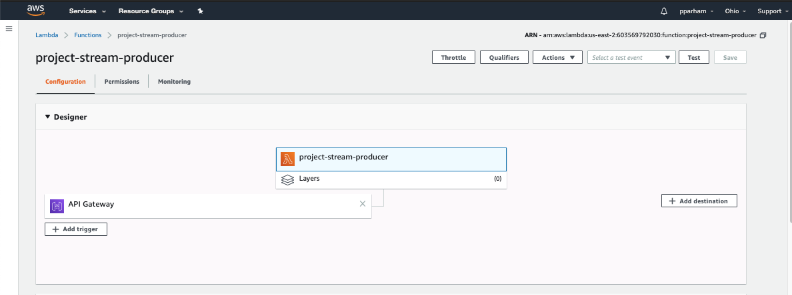
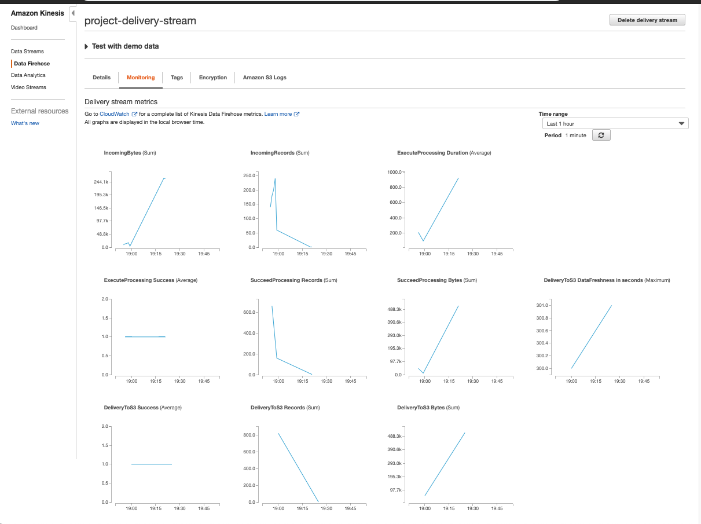

# Streaming Finance Data with AWS Lambda  
Utilizing yfinance data stock data for a selection of companies and an individual day, the project demonstrates an overview of the following workflow:
## 1. DataCollector  
Uses a lambda function to download our stock data  
The call used in the function is in data_collector.py   
## 2. DataTransformer  
Uses a lambda function to transform and send data into s3  
## 3. DataAnalyzer  
Process that allows for the querying of the sample data sent to s3

## Workflow  
The setup process begins with creating an AWS Kinesis Firehose Delivery Stream that has the function mentioned above that can transform our data in the proper format and deliver to an s3 bucket. The next step involves setting up a simple Lambda function, the DataCollector, that takes the desired stock data and puts it into the DataTranformer stream workflow. After utilizing the Kinesis, Lambda and s3 products, we also are able to leverage Athena and Glue. In order to query our data for any analysis we have to first point a Glue Crawler at the created s3 bucket in tandem with the functionality of Athena, the DataAnalyzer.

## Lambda Function url  
[https://qhx43zoyr2.execute-api.us-east-2.amazonaws.com/default/project-stream-producer](https://qhx43zoyr2.execute-api.us-east-2.amazonaws.com/default/project-stream-producer) 

## Documents  
1. finance_data folder - contains file sent to s3
2. data_collector.py - lambda source code for the DataCollector
3. query.sql - query used to generate results.csv file for highest hourly stock high per company
4. results.csv - query results
5. Assets - Images of Setup in Appendix (see below)

## Data Resource  
[yfinance: Yahoo! Finance market data downloader](https://pypi.org/project/yfinance/)  
Companies: Facebook (FB), Shopify (SHOP), Beyond Meat (BYND), Netflix (NFLX), Pinterest (PINS), Square (SQ), The Trade Desk (TTD), Okta (OKTA), Snap (SNAP), Datadog (DDOG)  
Date: May 14, 2020  
Interval: 1m  

## Appendix A
### DataCollector Lambda Configuration Page

## Appendix B
### Kinesis Data Firehouse Delivery Stream Monitoring

